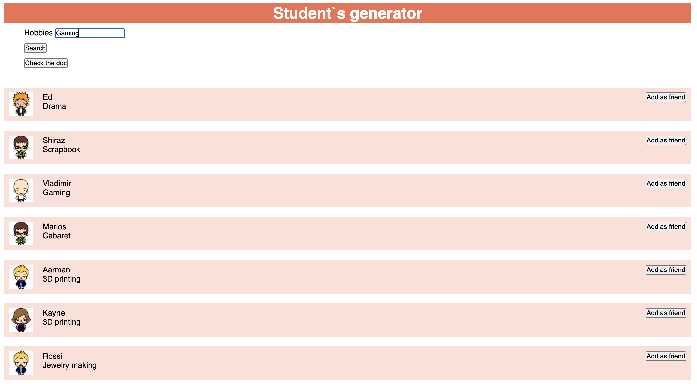

# Javascript for beginners

[TRY HERE! 🔥](https://amargopastor-code-along.github.io/ud-js-for-beginners/)

  

## Table of Contents

1. [include-js](./docs/02-include-js)
1. [console-log](./docs/03-console-log/index.html)
1. [variables](./docs/04-variables/index.html)
1. [operations](./docs/05-operations/index.html)
1. [text-strings](./docs/06-text-strings/index.html)
1. [functions](./docs/07-functions/index.html)
1. [if](./docs/08-if/index.html)
1. [nested-functions](./docs/09-nested-functions/index.html)
1. [boolean-logic](./docs/10-boolean-logic/index.html)
1. [denial](./docs/11-denial/index.html)
1. [else](./docs/12-else/index.html)
1. [switch](./docs/13-switch/index.html)
1. [conditional-functions](./docs/14-conditional-functions/index.html)
1. [while](./docs/15-while/index.html)
1. [while-break](./docs/16-while-break/index.html)
1. [while-continue](./docs/17-while-continue/index.html)
1. [for](./docs/18-for/index.html)
1. [arrays](./docs/19-arrays/index.html)
1. [arrays-push-pop](./docs/20-arrays-push-pop/index.html)
1. [arrays-splice](./docs/21-arrays-splice/index.html)
1. [iterate-through-array](./docs/22-iterate-through-array/index.html)
1. [multidimensional-array](./docs/23-multidimensional-array/index.html)
1. [objects](./docs/24-objects/index.html)
1. [JSON](./docs/25-JSON/index.html)
1. [undefined](./docs/26-undefined/index.html)

**[⬆ back to top](#table-of-contents)**
